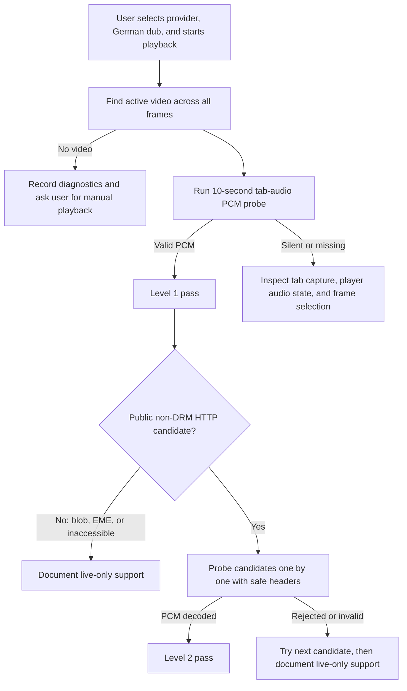

# AniWorld audio-acquisition experiment plan

## Purpose

Prove how reliably the extension can obtain the audio that the user selected on an AniWorld-style page with embedded third-party players. This phase ends at valid audio output. It does not run Whisper, translate text, render subtitles, or evaluate transcription quality.

The initial page used during earlier experiments was:

`https://aniworld.to/anime/stream/hunter-x-hunter/staffel-1/episode-1`

The visible provider choices included VOE, Doodstream, Filemoon, and Vidmoly. Treat those names as an initial test set, not as permanent assumptions. Providers and player implementations can change.

Only test content the user is authorized to access. Do not bypass DRM, paywalls, authentication, CAPTCHA, bot protection, or other access controls. Do not copy browser cookies or credentials into native tools. Do not save or distribute a complete media track. A short local diagnostic WAV is enough to prove that PCM capture works.

## What counts as success

There are two distinct success levels.

### Level 1: decoded tab-audio capture

The extension captures 10 seconds from the audible tab and produces mono, 16 kHz, signed 16-bit PCM without contacting WhisperLiveKit.

Level 1 passes when:

- The user starts the selected German dub and can still hear it normally during capture.
- Exactly one player is audible; ads or another tab are not mixed into the sample.
- The probe receives approximately 320,000 PCM bytes for 10 seconds.
- The result is not silent, all-zero, heavily clipped, or truncated.
- A short WAV can be played locally and the user confirms it contains the selected dub.
- Pausing the player stops the probe timeline rather than recording misleading silence as media progress.

This is the universal fallback. It is real-time and does not prove that the whole episode can be prepared before playback.

### Level 2: offline media-source acquisition

The extension discovers a public, non-DRM HTTP media candidate and a local PyAV probe can decode audio from it without Whisper and without playing the entire episode in the browser.

Level 2 passes when:

- The selected candidate is HTTP(S), not `blob:`, and does not report encrypted-media use.
- Required safe request headers are limited to values such as `User-Agent`, `Referer`, and `Origin`; no cookies or authorization tokens are copied from the browser.
- PyAV decodes a short window to mono 16 kHz PCM.
- The decoded window has plausible duration and non-silent audio metrics.
- The URL is resolved again for a new run instead of assuming an expiring URL remains valid.
- At least start and later timeline windows can be decoded when the source is seekable.

Level 2 is the evidence needed before connecting that provider to future full-video transcription. A Level 1 pass with a Level 2 failure is still a useful supported live-capture result.

## Current baseline

The repository already has useful pieces:

- `extension/service-worker.js` injects content scripts into all accessible frames and scores the most likely video frame.
- `extension/content.js` finds the primary `<video>`, reports `currentSrc`, detects `blob:` and encrypted media, and gathers recent MP4, WebM, HLS, and DASH-like resource URLs.
- `extension/offscreen.js` uses `chrome.tabCapture`, routes captured audio back to the speakers, and sends audio through an AudioWorklet.
- `extension/audio-worklet.js` mixes channels and emits 0.5-second, mono, 16 kHz PCM16 chunks.
- `server/batch_transcribe.py` can open public direct media with safe headers and PyAV.

### Evidence received on 2026-07-23

Two user-run exports refined the generic failure boundary:

- AnimeKai selected an embedded `megaplay.buzz` player and exposed two clear
  HLS-looking candidates on a CDN. Native acquisition reached them but received
  HTTP 403. Live tab transcription still worked.
- AniWorld selected a `playmogo.com` frame. The page observer found no reusable
  HTTP candidate, while live tab transcription still worked.

This did not prove that the sources were absent. The prior observer covered page
fetch/XHR/performance APIs, but could miss worker-originated requests,
extensionless manifests classified only by response content type, and pages
that were already open when a newly reloaded extension was injected.

Version 0.10.1 adds an experimental generic layer for those gaps:

- non-blocking `webRequest` observation for clear HTTP media traffic in the
  active tab, including worker traffic and segment evidence;
- response-content-type classification for extensionless HLS/DASH endpoints;
- immediate all-frame reinjection of the main-world observer, isolated bridge,
  and application content scripts when analysis starts;
- replay of only allowlisted request context (`Accept`, language, `Origin`,
  `Referer`, `Sec-Fetch-*`, and user agent);
- immediate rejection of cookies, authorization, and other credentials;
- visible observer readiness, candidate/segment counts, and safe header names.

The result remains **Experimental**. A 403 can still be legitimate when a host
requires cookies, authorization, CAPTCHA, anti-bot state, or another access
control that this project will not copy or bypass.

The main limitation for this experiment is that the offscreen document currently discards PCM unless WhisperLiveKit has completed its WebSocket configuration. The first implementation task is therefore an isolated audio-probe mode that never opens the recognizer socket.

## Target decision flow



## Phase 1: add an isolated audio-probe mode

Add a clearly separate development action such as **Capture 10-second audio probe**. It must not call `ensureRecognizerRunning`, open the WhisperLiveKit WebSocket, load Faster-Whisper, or modify transcript state.

Recommended behavior:

1. Require a user gesture in the extension popup.
2. Find the active media frame using the existing all-frame discovery.
3. Request a `tabCapture` stream ID and start the offscreen document in `probe` mode.
4. Keep routing the captured stream to `audioContext.destination` so the user still hears it.
5. Let the AudioWorklet emit its existing 0.5-second PCM16 chunks without waiting for `configuredForPcm` or an open WebSocket.
6. Collect only 10 seconds of chunks, then stop tracks and close or reset the AudioContext cleanly.
7. Compute and export diagnostics:

   - expected and received byte counts;
   - chunk count and any sequence gaps;
   - sample rate, channel count, and duration;
   - RMS level and peak absolute amplitude;
   - all-zero/silent sample ratio;
   - clipping ratio;
   - capture start/end timestamps;
   - active tab URL and redacted player-frame host;
   - current media time and playback state at start/end.

8. Produce a short PCM WAV as optional local evidence. Do not retain more than the probe window.
9. Save a small JSON result alongside it or make it available through a dedicated export button.

Keep probe state separate from `activeExperiment`; a failed probe must not corrupt or stop an existing completed transcript.

## Phase 2: improve source discovery diagnostics

Do not immediately add provider-specific scraping. First make the generic detector explain what it sees.

For every accessible frame containing a video, record:

- frame ID and redacted frame hostname;
- video area, visibility, readiness, paused state, duration, and current time;
- `currentSrc` classification: direct HTTP, HLS, DASH, blob, empty, or other;
- whether `mediaKeys` or an `encrypted` event indicates EME/DRM;
- candidate URL hostname, path extension/type, and discovery source (`currentSrc`, `<source>`, or Performance Resource Timing);
- whether the candidate appears expired between discovery and probe;
- why the frame won or lost the media-target score.

Redact query-string values from durable logs because signed media URLs can contain temporary secrets. Full candidate URLs may exist only in transient extension/native-host messages for the immediate user-initiated probe.

## Phase 3: probe candidates without transcription

The current generic batch chooser takes the first HTTP candidate. Embedded providers can expose stale manifests, ad media, poster/preload assets, or several quality variants. Replace the single-candidate assumption in the experimental path with ordered probing.

For each candidate:

1. Reject private-network, non-HTTP, encrypted, and obviously non-media sources using the existing validation rules.
2. Preserve only allowlisted request headers: `User-Agent`, `Referer`, and `Origin`.
3. Open the candidate with PyAV and decode a short audio window to mono 16 kHz PCM.
4. Stop before any Whisper model is constructed.
5. Return a structured result containing protocol/type, audio stream metadata, decoded seconds, PCM statistics, elapsed time, and a sanitized error.
6. Continue to the next candidate after expected failures such as 403, expired signature, manifest parse error, no audio stream, or unsupported protocol.
7. Select the first candidate with valid non-silent PCM; do not select merely because a URL pattern looks correct.

Prefer a small `probe_audio_source` native-host command or a standalone probe module shared with the batch worker. Avoid duplicating URL validation and header cleaning.

For a provider that passes the short probe, optionally validate later timeline windows. Do not download or export the complete audio track. If a future full-duration read is necessary, obtain explicit user approval first and discard decoded samples rather than saving the media.

## Phase 4: provider-by-provider iteration

Use a visible browser only. Test one provider at a time so the audio source is unambiguous.

For each provider:

1. Navigate to the user-specified episode page.
2. Select the German dub.
3. Select one provider.
4. Start playback manually or with a visible, ordinary player click.
5. Confirm only the intended player is audible.
6. Run the 10-second tab-audio probe.
7. Ask the user to confirm the WAV contains the correct German dub.
8. Run the offline candidate probe if the player reports public non-DRM candidates.
9. Record Level 1 and Level 2 independently.
10. Make the smallest generic fix supported by evidence, reload the extension, and repeat the same provider before moving to the next one.
11. For version 0.10.1 or later, expand **Diagnostics** before export and record
    `Media observer`, `HTTP discovery`, and `Safe request context`. These values
    distinguish a missed observer from a discovered source that the decoder
    could not acquire.

Initial matrix:

| Provider | Level 1 tab PCM | Level 2 source PCM | Source type | Frame host | Time to PCM | Notes |
|---|---:|---:|---|---|---:|---|
| VOE | Not tested | Not tested | Unknown | Unknown | — | — |
| Doodstream | Not tested | Not tested | Unknown | Unknown | — | — |
| Filemoon | Not tested | Not tested | Unknown | Unknown | — | — |
| Vidmoly | Not tested | Not tested | Unknown | Unknown | — | — |

Also repeat these lifecycle checks for every passing provider:

- pause and resume;
- seek forward and backward;
- switch provider and ensure the old capture is closed;
- reload the episode page and start a fresh probe;
- verify captured tab audio remains audible to the user;
- verify an ad or popup was not captured instead of the episode.

## Iteration rules for the testing agent

- Work only on `agent/aniworld-audio-probe`, created from the published `main` baseline. Do not commit to `main` or the parallel `feature/bilingual-learning-captions` branch.
- Preserve the working YouTube 0.6.4 batch path.
- Do not run Whisper as part of provider discovery.
- Do not guess that a large `<video>` is correct; prove it with PCM and user confirmation.
- Prefer generic frame/source fixes over hardcoded provider selectors.
- Add a provider adapter only when diagnostics demonstrate a stable provider-specific requirement.
- Never bypass DRM, authentication, CAPTCHA, anti-bot checks, or browser security controls.
- Never install software offered by a streaming page, enable notifications, or interact with advertisements.
- Do not transfer cookies, local storage, authorization headers, or account credentials to native code.
- Do not use a hidden browser. Keep browser actions visible and ask the user to handle ambiguous player, language, CAPTCHA, login, or popup interactions.
- Keep complete candidate URLs and short WAV files out of source control.
- Run local unit tests after every implementation iteration and the complete regression suite before handoff.

## Evidence format

Store sanitized reports under a gitignored runtime or experiment-results directory. One JSON record per attempt should include:

```json
{
  "providerLabel": "VOE",
  "attemptedAt": "ISO-8601 timestamp",
  "pageHost": "aniworld.to",
  "frameHost": "redacted provider host",
  "videoFound": true,
  "sourceKind": "blob|hls|dash|direct|unknown",
  "drmReported": false,
  "tabProbe": {
    "status": "pass|fail",
    "durationSeconds": 10,
    "pcmBytes": 320000,
    "rms": 0.0,
    "peak": 0.0,
    "silentRatio": 0.0
  },
  "sourceProbe": {
    "status": "pass|fail|not-applicable",
    "candidateCount": 0,
    "selectedCandidateType": null,
    "decodedSeconds": 0,
    "elapsedSeconds": 0,
    "errors": []
  },
  "userConfirmedLanguage": false,
  "notes": ""
}
```

Do not include signed query strings, cookies, tokens, or full media URLs in the report.

## Expected code touchpoints

Likely files, subject to what diagnostics prove:

- `extension/popup.html`, `popup.js`, and `popup.css`: development probe action and status.
- `extension/service-worker.js`: probe lifecycle, frame diagnostics, result export, and source-candidate orchestration.
- `extension/offscreen.js`: recognizer-free probe mode and bounded PCM collection.
- `extension/audio-worklet.js`: only if sequence metadata or more robust metrics require it.
- `extension/content.js`: richer per-frame source diagnostics.
- `server/native-host.cs`: a new probe command only if native PyAV probing is used.
- `server/batch_transcribe.py` or a new shared Python module: decode-only probe logic that never constructs `WhisperModel`.
- New unit tests for probe state, PCM metrics/WAV encoding, candidate ordering, URL redaction, and cleanup.

## Required verification

At minimum, keep the existing suite green:

```powershell
node --check .\extension\service-worker.js
node .\extension\test-batch-lifecycle.mjs
node .\extension\test-transcript-groups.mjs
node .\extension\test-coverage.mjs
node .\extension\test-segmentation.mjs
.\.venv\Scripts\python.exe -m py_compile .\server\batch_transcribe.py
Push-Location .\server
..\.venv\Scripts\python.exe -m unittest test_batch_transcribe test_subtitle_lines
Pop-Location
```

Add focused probe tests and include them in the final command list.

## Completion criteria

This experiment is complete when:

- The probe mode can produce a confirmed 10-second German-dub WAV without Whisper.
- Each available provider has a sanitized result with separate Level 1 and Level 2 outcomes.
- At least one provider passes Level 1.
- Any claimed offline-capable provider passes an actual PyAV PCM probe, not only URL discovery.
- Switching, pausing, seeking, stopping, and page reload clean up capture resources.
- Existing YouTube tests remain green.
- The final report explains which providers support future full-video preparation and which are live-only.
